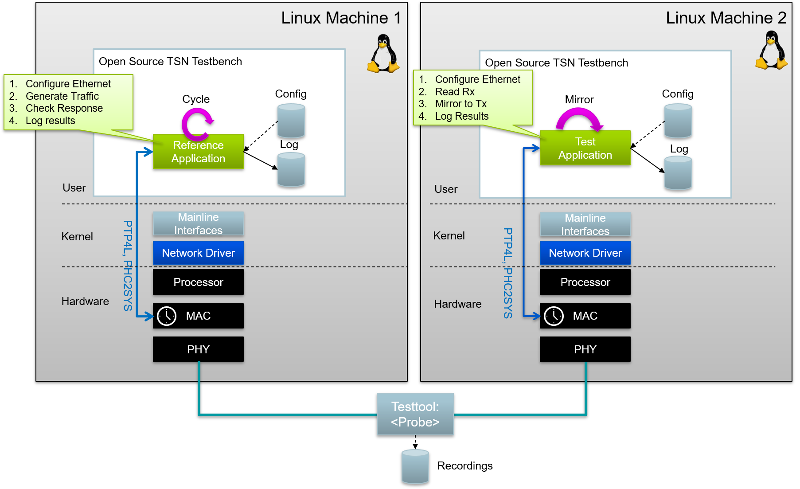

# Linux RealTime Communication Testbench

## About

The Linux RealTime Communication `Testbench` is a real-time and non-real time traffic validation
tool for converged Ethernet networks with and without utilization of TSN mechanisms. PROFINET as
well as OPC/UA PubSub and other configurable protocols are supported. Furthermore, the performance
validation of security algorithms for a particular hardware can be validated. The evaluation
application generates RT and non-RT traffic, mirrors traffic and performs consistency and latency
checks. The Linux RealTime Communication `Testbench` is split into two applications:

- `reference`: Traffic generation and checking simulation
- `mirror`: Traffic mirror application for traffic generated by `reference`
  application

The concept is shown below.

### Motivation

Over the last years the Linux kernel and open source ecosystem is more and more optimized for
hard-realtime applications with the resulting Ethernet communication capabilities. Time
synchronization with PTP via 802.1AS and various traffic shapers defined by IEEE enable
deterministic frame reception and transmission. Furthermore, the PREEMPT_RT preemption model turns
Linux into a real-time Operating-System. How well do these mechanisms perform for real world use
cases? For instance, is it possible to run protocols like PROFINET or OPC UA Pub/Sub with the help
of TSN mechanisms on top of Linux? Which jitter, cycle times, throughputs and latencies can be
achieved on a given hardware and firmware platform? Which measures can be taken to optimize these
figures?

To answer these questions, the Linux RealTime Communication `Testbench` has been developed. The
purpose of that tool is to evaluate the robustness and realtime-performance of manufacturer’s
hardware as well as underlying drivers and the Linux network stack itself. It is not intended to be
used as a TSN conformance testing tool, it is intended for platform evaluations and
optimizations. The tool itself is independent of any hardware manufacturers. All used TSN mechanisms
are utilizing mainline Linux only utilities for data and control plane.

While the development of the tool started for PROFINET RT and later TSN, it is now able to generate
any kind of cyclic Ethernet payload. This way, different middlewares next to PROFINET such as OPC/UA
can be simulated and tested.

Driven by legal requirements like EU Cyber Resilience Act (CRA), security for industrial
communication systems is more and more playing a crucial role. The RTC `Testbench` can also be used
to measure and optimize the performance of a particular security implementation for authentication
and/or encryption of each processed frame.

### Architecture

The application itself performs cyclic Ethernet communication. There are
different traffic classes ranging from real time Layer 2 up to UDP
communication. The cyclic receivers and transmitters utilize either traditional
`AF_PACKET` or modern `AF_XDP` sockets. For both socket types the receive
flow is configured via either BPF filters or eBPF XDP programs. Based on the
configuration, or profiles, the Linux RealTime Communication `Testbench` can simulate different
traffic types such as PROFINET or OPC/UA PubSub. The image below shows an
example of three different middlewares in combination with non-real time
applications utilizing XDP.

## Resources

Project home: https://github.com/Linutronix/RTC-Testbench

Project documentation: https://linutronix.github.io/RTC-Testbench

Contribution: See [CONTRIBUTING](https://github.com/Linutronix/RTC-Testbench/blob/main/CONTRIBUTING.md)

This project is maintained by: [Linutronix](https://www.linutronix.de/)

## Features

Linux RealTime Communication `Testbench` features include:

- Real-time and non-real time protocols
- Configurable traffic class mapping
- Configurable cycle time, frames, frame size, vid
- Real-time security support with configurable algorithms like AES256
- Multiple middleware simulation like PROFINET and OPC/UA
- Usage of PTP for time synchronization
- Flexible Linux Ethernet interface usage like XDP, XDP/ZC, AF/PACKET, busy polling
- End station Qbv

## ToDo

The following list contains ideas for further development:

- Add interface for workload emulation
- Add support for XDP and Tx Launch Time
- Add configurations for other hardware platforms (hybrid!) and NIC(s)
- Add integration with `ClockManager`
- Test (virtual) container networking
- Package for Debian

## Documentation

The documentation includes information on how to build, use and run the Linux
RealTime Communication `Testbench`. The documentation is available at
https://linutronix.github.io/RTC-Testbench

## Credits

Idea and initial funding by Phoenix Contact Electronics GmbH

Supported by Siemens AG and Intel Corporation

## Copyright

Copyright (C) 2020-2025 Linutronix GmbH

Copyright (C) 2024 Intel Corporation

## License

BSD-2 Clause and Dual BSD/GPL for all eBPF programs
